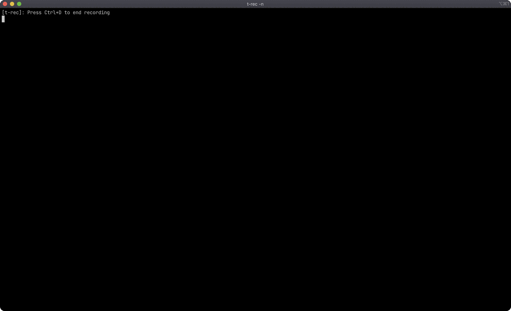

<div align="center">

# pretty-pileup

**_Pretty Printing for SAMtools Pileups_**



</div>

`pretty-pileup` provides stylized printing of SAMtools pileup information from
BAM and SAM files.

**Features:**

 - Color-coded nucleotides
 - Gradient-based coloring of base qualities (red -> green)

## Usage

```bash
pretty-pileup --bam-file test.bam --fasta test.fasta | less
```

## Installation

To build and use `pretty-pileup` you must have Rust installed: 
[link](https://www.rust-lang.org/tools/install). The instructions below can
then be used to clone and build the source code.

```
git clone https://github.com/pblischak/pretty-pileup
cd pretty-pileup/
cargo build --release
cargo test
cargo install
```

## Acknowledgements

The following projects were a huge help in writing `pretty-pileup`:

 - [`rust-htslib`](https://github.com/rust-bio/rust-htslib.git): This is an
   amazing library that wraps `htslib` and provides an excellent, high-level
   Rust API. I wouldn't have been able to write `pretty-pileup` without it.
 - [`exa`](https://github.com/ogham/exa.git): `exa` is a command line replacement
   for the Unix command `ls` written in Rust. I used its error handling model to
   deal with broken pipes when calls to `pretty-pileup` are piped into `less`
   (or another pager) but are terminated before the full file is read. Rust typically
   panics in these cases unless you handle the broken pipe error correctly and the
   code in `exa` was instrumental in making sure that didn't happen unnecessarily.
